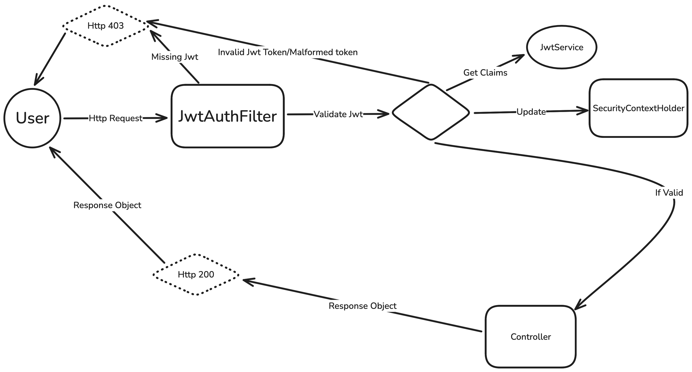

# Boat Management API

A Spring Boot application that implements JWT authentication and provides RESTful endpoints to manage boats. This application allows users to register, sign in, and perform CRUD operations on boats.

## Table of Contents

- [Boat Management API](#boat-management-api)
  - [Table of Contents](#table-of-contents)
  - [Features](#features)
  - [Prerequisites](#prerequisites)
  - [API Endpoints](#api-endpoints)
    - [Authentication](#authentication)
      - [Register](#register)
      - [Sign In](#sign-in)
    - [Boat Management](#boat-management)
      - [Get All Boats](#get-all-boats)
      - [Create a Boat](#create-a-boat)
      - [Delete a Boat](#delete-a-boat)
  - [JWT Implementation](#jwt-implementation)
  - [Technologies Used](#technologies-used)

---

## Features

- **User Authentication**: Secure user registration and authentication using JSON Web Tokens (JWT).
- **Boat Management**: CRUD operations for managing boats.
- **Secure Endpoints**: Protected API endpoints that require a valid JWT token.
- **RESTful API**: Clean and easy-to-use API endpoints.

## Prerequisites

- **Java 17** or higher
- **PostGresq** database

## API Endpoints

### Authentication

#### Register

- **URL**: `/api/v1/auth/register`
- **Method**: `POST`
- **Body**:

  ```json
  {
    "email": "user@example.com",
    "password": "your_password"
  }
  ```

- **Response**:

  ```json
  {
    "token": "jwt_token_here"
  }
  ```

#### Sign In

- **URL**: `/api/v1/auth/signin`
- **Method**: `POST`
- **Body**:

  ```json
  {
    "email": "user@example.com",
    "password": "your_password"
  }
  ```

- **Response**:

  ```json
  {
    "token": "jwt_token_here"
  }
  ```

### Boat Management

All boat management endpoints require a valid JWT token in the `Authorization` header:

```
Authorization: Bearer jwt_token_here
```

#### Get All Boats

- **URL**: `/api/v1/boat`
- **Method**: `GET`
- **Response**:

  ```json
  [
    {
      "id": 1,
      "name": "Boat One",
      "type": "Sailboat"
    },
    {
      "id": 2,
      "name": "Boat Two",
      "type": "Motorboat"
    }
  ]
  ```

#### Create a Boat

- **URL**: `/api/v1/boat`
- **Method**: `POST`
- **Body**:

  ```json
  {
    "name": "New Boat",
    "type": "Kayak"
  }
  ```

- **Response**:

  ```json
  {
    "id": 3,
    "name": "New Boat",
    "type": "Kayak"
  }
  ```

#### Delete a Boat

- **URL**: `/api/v1/boat/{id}`
- **Method**: `DELETE`

## JWT Implementation

The application uses JWT for securing the API endpoints. Upon successful authentication, the server issues a JWT token, which the client must include in the `Authorization` header to access protected routes.



## Technologies Used

- **Spring Boot** - Application framework
- **Spring Security** - Authentication and authorization
- **JWT (JSON Web Tokens)** - Secure token-based authentication
- **PostGresq** - Relational database
- **Maven** - Build and dependency management